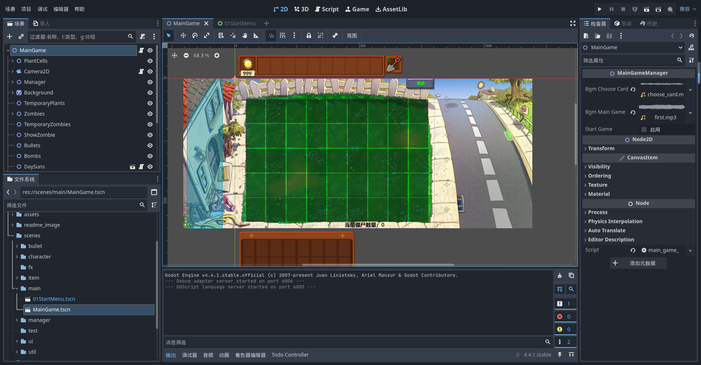

# 🌱 使用godot重置PVZ

从95版、植物娘、胆小菇之梦，到杂交版、融合版、恐怖版等众多精彩的改版与同人作品，

相信许多玩家都曾萌生过属于自己的创意与幻想。

本项目基于 [Godot4.5.1](https://godotengine.org/zh-cn/) 引擎，继承于[hsk-dream](https://github.com/hsk-dream/PVZ-Godot-Dream)大佬搭建的基础框架，

继续致力于对原版《植物大战僵尸》进行godot复刻，同时添加一些额外有趣的内容。

目前除部分小游戏外已经基本实现所有原版内容，

欢迎各位大佬在本开源项目基础上，完成属于自己的 PVZ 同人改版之梦！

**考虑到版权问题，将原版相关资源文件删除。**

## 项目展示

### 主游戏界面



### 开始菜单界面


### 自定义关卡

- 自定义关卡使用在游戏根目录下"level_game_para"文件夹中的游戏参数文件。
- 游戏参数文件为"ResourceLevelData"类型的资源文件
- 具体查看脚本文件"res://scripts/resources/level/level_data.gd"

## 游戏开发相关

[基于本项目开发pvz同人改版必看内容（./docs/开发相关.md）](./docs/开发相关.md)

### 插件

#### [anim_player_refactor](https://github.com/poohcom1/godot-animation-player-refactor)

一个 Godot 插件，用于重构 AnimationPlayer 的动画。
[插件使用教程](https://www.bilibili.com/video/BV1GxXWYZExH?spm_id_from=333.788.videopod.sections&vd_source=1005534986b111b7c1911fe1c36ac835)

注意：目录下**plugin.gd**脚本中调用的函数EditorUtil.find_animation_menu_button(base_control)只支持英文，需要进入函数修改对应的代码 func(node): return node.text == "Animation" 修改为 func(node): return node.text == "Animation" or node.text == "动画"

### [R2Ga_PVZ](https://github.com/hsk-dream/PVZ_reanim2godot_animation)

将植物大战僵尸的动画文件转换为Godot游戏引擎所支持的动画格式。[使用教程](https://www.bilibili.com/video/BV1XBKwzdELA/)
forked from [PVZ_reanim2godot_animation](https://github.com/HYTommm/PVZ_reanim2godot_animation)

### PVZ相关参考资料

- [［PVZ解包］一代PVZ植物大战僵尸PAK文件解包教程(https://www.bilibili.com/video/BV1JQ4y1k7KS/)](https://www.bilibili.com/video/BV1JQ4y1k7KS/)

- [Godot4.3——植物大战僵尸：游戏制作教程（已完结） (https://www.bilibili.com/video/BV1AdBtY9Ec5/)](https://www.bilibili.com/video/BV1AdBtY9Ec5/)

- [R2Ga转换器v3.1发布！ (https://www.bilibili.com/video/BV1s3ZbY3E9L/)](https://www.bilibili.com/video/BV1s3ZbY3E9L/)

- [PVZ wiki（https://wiki.pvz1.com/doku.php?id=home）](https://wiki.pvz1.com/doku.php?id=home) 

## 📜 许可协议：Custom Non-Commercial License

本项目为《植物大战僵尸》复刻的学习作品，仅供个人学习与研究使用。
原作《植物大战僵尸》的游戏名称、角色、音乐、图像等内容的版权归 **PopCap Games** 及其母公司 **Electronic Arts（EA）** 所有，
本项目不用于任何商业目的，也不构成对原作版权的挑战或侵犯。

本项目采用自定义非商用许可协议，**禁止任何形式的商业用途**，其余条款与 MIT 协议一致，简要如下：

### ✅ 允许

- 个人学习与研究；
- 学术研究与教学用途；
- 《植物大战僵尸》相关的非营利改编、同人创作。

### ❌ 禁止

- 商业公司或组织内部使用；
- 将本项目作为产品或服务的一部分进行销售、收费分发或在线提供；
- 用于 SaaS、API 服务、BaaS 等直接或间接商业用途。

---

🔗 完整许可条款请查看 [LICENSE 文件](./LICENSE)

## 🙌 致谢

致敬《植物大战僵尸》原作团队（PopCap & EA）

### 项目贡献

- 植物图鉴初稿整理：[多003_](https://space.bilibili.com/472181151)
- 宽屏（16:9）的部分素材使用[豆包ai](https://www.doubao.com/chat)生成,感谢ai

### 参考项目

- 樱桃炸弹爆炸动画粒子特效: [HYTommm](https://space.bilibili.com/3493140163988287)开源项目[Godot-PVZ](https://github.com/HYTommm/Godot-PVZ)
- 信号总线,随机选择器: [玩物不丧志的老李](https://space.bilibili.com/8618918)开源项目[godot_core_system](https://github.com/LiGameAcademy/godot_core_system)
- 种子雨雨幕：[简单的小雨氛围：shader写的雾、粒子做的雨和水花 | godot4教程](https://www.bilibili.com/video/BV15ibAz4EZi)

---

# 组件

## 一、设计思想

每个角色 = `Character000Base` 场景 + 一堆**可插拔的功能组件**。所有组件都继承自同一个祖先：

### 🧩 ComponentNormBase（组件宪法）

提供**多因素启停系统**：每个组件有一个因素字典 `{Sleep: false, Attack: true, Death: ...}`，只有全部为 true 组件才工作。所以“睡觉时禁用攻击”、“死亡时禁用受击框”这类逻辑不用改业务代码，调一下 `disable_component(因素)` 就行。

---

## 二、组件分类详解

### ❤️ 生命 & 受击组

| 组件                         | 作用                                                                                                                        |
| -------------------------- | ------------------------------------------------------------------------------------------------------------------------- |
| **HpComponent**            | 血量总账：`Hp_loss()` 掉血、发死亡信号、血条 UI。子类 `HpPlant`（植物）/`HpZombie`（含防具血量、死亡后继续掉血的尸体节奏）                                           |
| **HurtBoxComponent**       | 受击盒子 = 两个 Area2D：`HurtBoxDetection`（给子弹/啃食检测用，layer 2）+ `HurtBoxReal`（真实判定 layer 256）。僵尸版多了**攻击时前伸的受击框**——大嘴花才能咬到正在啃植物的僵尸 |
| **HpStageChangeComponent** | 掉血换脸：按血量临界值切换贴图——僵尸掉手→掉头、坚果出裂纹、南瓜凹陷                                                                                       |
| **CharredComponent**       | 被火爆辣椒/樱桃炸弹烧死后播放炭黑动画（会把自己从角色身上挪到父节点，防止跟着一起删）                                                                               |
| **DropItemComponent**      | 僵尸死亡掉战利品：按概率掉银币/金币/钻石/花园植物                                                                                                |

### 👁️ 感知组

| 组件                   | 作用                                                                                                                                                                                          |
| -------------------- | ------------------------------------------------------------------------------------------------------------------------------------------------------------------------------------------- |
| **DetectComponent**  | ⭐ 核心！攻击射线检测（植物僵尸通用）。一个 Area2D 罩住前方区域，敌人进来自动判：同行吗？状态可打吗？（跳跃中/潜水不可打）隔梯子的植物能打吗？被魅惑后自动换阵营目标层。发出 `signal_can_attack / not_can_attack`。变种：仙人掌版（额外扫空中目标）、巨人版（砸罐子）、倭瓜版（位置判定）、全局版（挂 MainGame 给追踪子弹用） |
| **SwimBoxComponent** | 进出水池检测：切换 `is_swimming`（联动动画状态机）、水花特效、body 换鸭子泳圈；潜水僵尸版潜入水下                                                                                                                                  |

### ⚔️ 攻击行为组（都继承 AttackComponentBase 的四因素开关）

| 组件                                          | 用在谁身上                                                                        |
| ------------------------------------------- | ---------------------------------------------------------------------------- |
| **AttackComponentBulletBase**               | 直射射手（豌豆/雪花豌豆…）：CD 计时器循环 → 触发 OneShot 播 Attack 动画 → 动画里 `_shoot_bullet()` 发子弹 |
| **PultBase**                                | 投手类（卷心菜/西瓜/玉米）：抛物线弹道，每次攻击锁定**最前面**的敌人                                        |
| Corn / SplitPea / ThreePea / Cactus / Track | 玉米（概率投黄油）/ 裂荚双向 / 三线（边路补偿）/ 仙人掌（能对空）/ 追踪（紫卡加农炮等）                             |
| **AttackComponentZombieNorm**               | 普通僵尸啃食：按攻击间隔持续扣血，每口动画调用发亮                                                    |
| Gargantuar / Zamboni / Ladder               | 巨人锤击（还能砸罐子、砸脑子）/ 冰车碾压 / 扶梯僵尸判断搭梯                                             |

### 💥 特殊机制组

| 组件                                                | 作用                                                                                             |
| ------------------------------------------------- | ---------------------------------------------------------------------------------------------- |
| **BombComponentBase + Norm/Ice/Jalapeno/Jackbox** | 爆炸家族：爆炸范围按“行”配置（-1 全屏/0 本行/1 上下行）、是否灰烬级、死亡时未爆则补爆、屏幕震动。Ice=全场冰冻、Jalapeno=整行清空、Jackbox=小丑早爆/晚爆概率 |
| **JumpComponent**                                 | 跳跃（撑杆跳/海豚骑手）：跳过植物、**高坚果拦截判定**、跳跃补偿防跳过头                                                         |
| **MagnetComponent**                               | 磁力菇：范围内吸走僵尸铁器，消化 CD 后吐出                                                                        |
| **ScaredyComponent**                              | 胆小菇：有敌人靠近就缩起来停止攻击                                                                              |
| **SleepComponent**                                | 白天睡觉：把 `sleep_influence_components` 列表里的组件（眨眼/攻击）整体禁用                                          |
| **FogClearerComponent**                           | 三叶草驱雾                                                                                          |

### 🌻 生产组

| 组件                      | 作用                                           |
| ----------------------- | -------------------------------------------- |
| **CreateSunComponent**  | 向日葵：定时生产阳光（首次/后续间隔分开配、生产前发光、阳光价值可变——阳光豆蘑菇升级） |
| **CreateCoinComponent** | 金盏花：定时掉金银钻                                   |

### 🎬 表现组

| 组件                   | 作用                                                                                                                                             |
| -------------------- | ---------------------------------------------------------------------------------------------------------------------------------------------- |
| **AnimComponent 家族** | 动画速度统一入口：Norm 版（驱动 AnimationTree 的 TimeScale）/ Player 版（直接改 speed_scale）/ Empty（保龄球无动画）/ Bobsled 特殊版。全场减速（冰冻/黄油）经 `signal_update_speed` 自动传到这里 |
| **BlinkComponent**   | 随机眨眼：配 `ResourceBodyChange` 资源指定“哪个节点的常态图↔眨眼图”互换；攻击时自动停眨                                                                                       |
| **MoveComponent**    | 僵尸移动引擎：读 owner 的 `is_walk` 决定走不走、跟随 `_ground` 节点（随背景滚动）、屋顶斜坡 y 修正、爬扶梯上下全程处理                                                                    |
| **BodyCharacter**    | body 视觉状态机：受击闪白、冰冻变蓝、模仿者紫色材质、被压扁复制残影、水下裁剪显示                                                                                                    |

### 🦠 僵尸专属组

| 组件                                                         | 作用                                                      |
| ---------------------------------------------------------- | ------------------------------------------------------- |
| **IronNode / IronNodeArmor**                               | 路障/铁桶=独立血量的“铁器”子实体，被打飞、可被磁力菇吸走                          |
| **drop_body/（ZombieDropBase 系列）**                          | 断手、断头掉落物理表现                                             |
| **JacksonManager + StateMachine / DancerManagerComponent** | 舞王系统：一个 manager 管“舞王+4伴舞”队列，同步跳舞动画、举手/walk 循环、第二次入场召唤伴舞 |

### 🏡 花园组

- **GardenComponent / GardenSprout**：禅境花园的需求系统（浇水/施肥/杀虫/听歌）、成长阶段升级、完美植物产币

---

## 三、如何协作（以豌豆射杀一只僵尸为例）

复制

```
DetectComponent 发现僵尸 ──can_attack──▶ AttackComponentBulletBase
                                            │ CD 到点，OneShot request=FIRE
                                            ▼
                                      Attack 动画播放
                                            │ Method 轨道 @0.5s
                                            ▼
                                       _shoot_bullet() ──▶ 子弹飞行
                                                              │ 命中 layer 2 检测框
                                                              ▼
                              僵尸 HurtBoxComponent ──▶ HpComponentZombie.Hp_loss()
                                                              │ 血量过临界值
                                                              ▼
                                   HpStageChangeComponent 换贴图（掉手/掉头）
                                                              │ 血量归零
                                        character_death() ──▶ DropItemComponent 掉金币
                                                              ──▶ CharredComponent(若被烧死)
```
